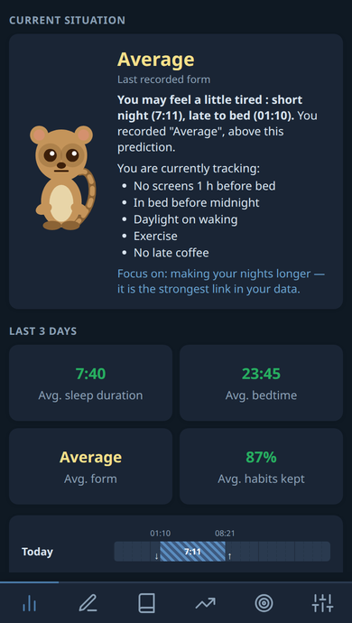
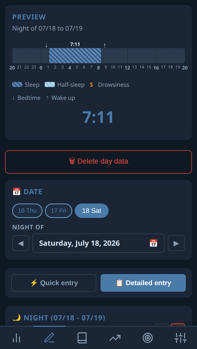
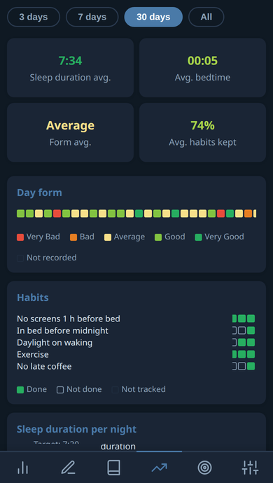
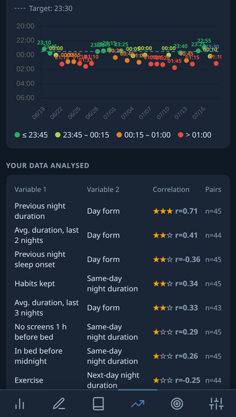
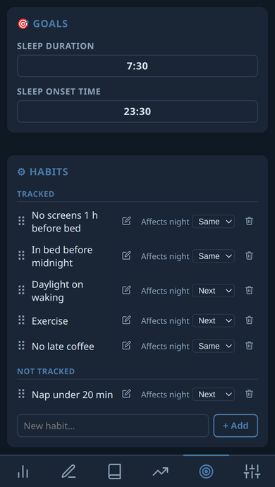
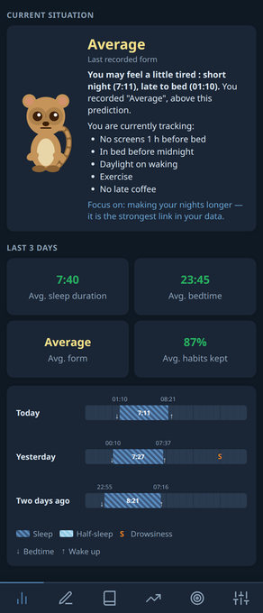
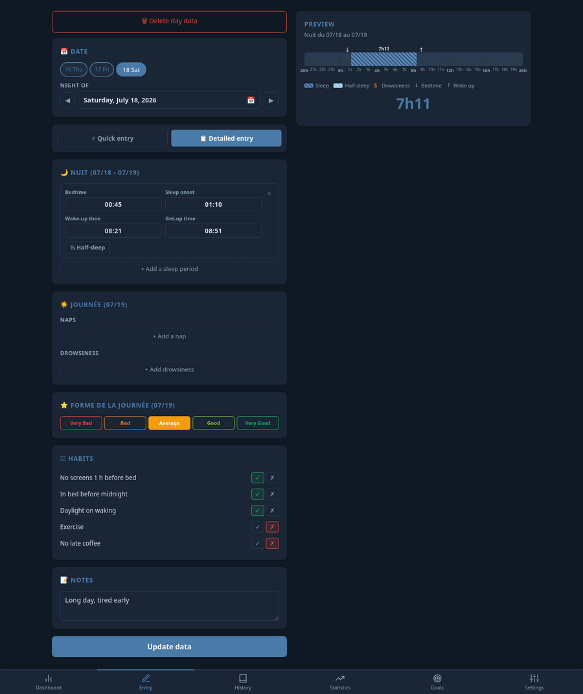
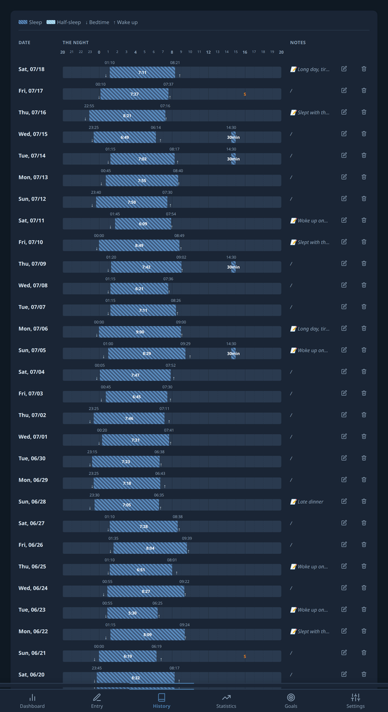
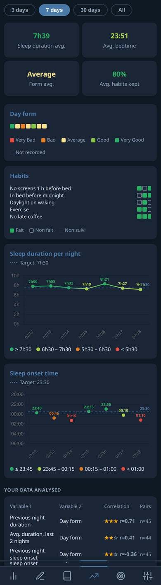
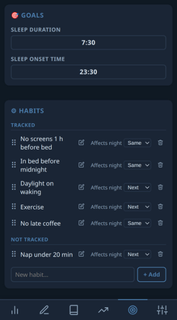

# Sleep & Vigilance Diary

Keep a diary of how you sleep, and find out what actually changes how you feel.

Every morning you record when you went to bed, when you fell asleep and when you woke up. Every evening you say how your day went. After a few weeks the app tells you what is really linked to your good days — going to bed earlier, sleeping longer, keeping a particular habit — based on **your** nights, not on general advice.

<p align="center">
  
  
  
  
  
</p>
<p align="center"><em>Dashboard · Recording a night · Statistics · Correlations · Goals and habits</em></p>

It works on an **Android phone** and in a **web browser**. Everything stays on your device: nothing is sent anywhere, no account, no sign-up, and it works without an internet connection.

> **⚠️ Still in testing.** This is a personal project under active development, not a finished product. Expect rough edges and expect things to change. Please **export your data from time to time** (Settings tab) — a future version may not be able to read what an older one saved.

## Why keep a sleep diary

A sleep diary is not a tracking gadget. It is the standard clinical instrument for assessing insomnia, and it is the entry point to the treatment that works best over time.

**For chronic insomnia, guidelines put behavioural treatment ahead of sleeping pills.** The European Sleep Research Society, the American College of Physicians and the American Academy of Sleep Medicine all recommend **cognitive behavioural therapy for insomnia (CBT-I) as the first-line treatment in adults**, before any medication. Sleeping pills are positioned as short-term help when CBT-I is unavailable or insufficient.

The reason is not that pills do not work, but *how* they work over time. Trials comparing the two find broadly similar short-term relief, and a clear divergence afterwards: the benefits of CBT-I hold once treatment stops, whereas the benefits of hypnotics fade when they are discontinued, on top of tolerance and dependence concerns with long-term use.

**A diary is the raw material CBT-I runs on.** Sleep restriction and stimulus control — its two most effective components — are dosed from what the diary records. The [Consensus Sleep Diary](https://doi.org/10.5665/sleep.1642) (Carney et al., 2012) exists precisely because clinicians needed a standard form for this. Two weeks of entries are the usual basis for an assessment.

Recording also has an effect of its own: it turns vague impressions into something you can look at. People routinely believe they slept far worse than they did, and a written trace is what corrects that.

**What this app adds: correlations computed on your own data.** Beyond recording, it measures — night after night — what actually goes with your good and bad days. Not generic advice: **your** numbers. It correlates your day form against how long you slept, the average of your last 2, 3 and 5 nights, what time you fell asleep and what time you went to bed.

And, crucially, **against the habits you define yourself**. You add the ones you care about — no screens before bed, exercise, no late coffee, whatever you are trying to hold — you tick them off each day, and you say whether each one should affect the night that follows or the one after. The app then computes a separate correlation for every habit and ranks them by strength, so you can see which of your own rules actually make a difference for you, and which make none.

**What it is not.** It follows the structure of the [Réseau Morphée](https://reseau-morphee.fr/) sleep diary. It is a diary and a mirror — not a diagnosis, not a therapy, and no substitute for a doctor. Correlation is not causation, and a few dozen nights is a small sample: the app shows the number of pairs behind every figure for that reason. If your sleep worries you, take the diary to a professional: that is exactly what it is good for.

## Try it

Two ways, independent of each other. Pick either.

### On your phone

Nothing to install beyond the app itself.

1. From your phone, open the [latest release](https://github.com/Plotkine/Sleep_tracking_app/releases/latest) and download `agenda-sommeil-debug.apk`.
2. Tap the downloaded file.
3. Android will refuse the first time and say it is *not allowed to install unknown apps from this source*. Tap **Settings** in that message, allow it for the app you downloaded with, then tap the file again.
4. You may also see a Play Protect warning, because the app does not come from the Play Store: **More details → Install anyway**.

It then appears as **Agenda du Sommeil** in your app list, and starts with an empty diary.

### In a browser

```bash
git clone https://github.com/Plotkine/Sleep_tracking_app.git
cd Sleep_tracking_app
python3 sleep_server.py
```

Your browser opens on the app. Press `Ctrl+C` in the terminal to stop it.

### Using both

The phone and the browser keep **separate diaries** — they do not sync. To move your nights from one to the other, use **Export** in the Settings tab, transfer the file, then **Import** on the other side. That file holds everything: your nights, your habits and your goals.

## What you can do with it

*Screenshots taken on a phone, with made-up data.*

### See where you stand

A short summary of the last three days, and a plain sentence telling you how your day is likely to go, given how you slept — followed by whether that matched how you actually felt. Underneath, your nights drawn on a 24-hour strip, so you can see at a glance whether you slept in one block or woke up in the middle.



### Record a night

Enter the evening and morning times — when you got into bed, when you think you fell asleep, when you woke, when you got up. Add naps, moments when you felt sleepy during the day, how your day went, which of your habits you kept, and a free note. A preview updates as you type. In a hurry, a quick mode lets you record only a total duration.



### Look back

Every night since you started, one row per day, drawn to scale. Days you did not record stay visible as empty rows, so gaps are obvious rather than hidden.



### Understand what affects you

Your sleep duration and bedtime plotted night after night against the goals you set, and a table showing which factors go together with your good days — the previous night's length, the average of the last few nights, what time you fell asleep, each habit you track. Strength is shown with stars, and the clearest links are explained with a small chart.



### Set goals and track habits

Choose a target sleep duration and bedtime; they appear as reference lines on the charts. Add the habits you want to hold — no screens before bed, exercise, no late coffee — and say whether each one affects the night that follows or the one after. The app then measures whether they actually make a difference for you.



## What it deliberately does not do

**No bullsh*t.** No meditation tracks. No breathing exercises. No notifications, no reminders, no nudges. No AI, no chatbot, no "insights" generated by a model. No automatic sleep detection from your phone's sensors or a wearable. No alarm clock. No sleep score out of 100. No account, no sign-up, no subscription, no ads, no analytics, no cloud.

You type what happened, and the app does arithmetic on it — that is the whole product.

The only questionable feature is the meerkat mascot :-)

## Your data

Your diary is stored **only on the device you entered it on**, in `data/` for the web version and inside the app itself on Android. `data/` is deliberately excluded from this repository: it is personal health information.

Export and import are the only way to move or back up your diary, and the only bridge between phone and browser.

## For developers

<details>
<summary>Technical notes</summary>

No build step, no bundler, no runtime dependency — Chart.js is vendored so the Android app works offline. The frontend is plain HTML, CSS and classic JavaScript files (not ES modules: top-level functions stay global, which the markup's `onclick` handlers rely on).

| Path | Role |
|---|---|
| `sleep_server.py` | Minimal HTTP server: pages, static files, JSON API |
| `frontend/sleep_agenda.html` | Markup: navigation and tab containers |
| `frontend/css/styles.css` | All styles |
| `frontend/js/*.js` | The app, split by responsibility |
| `android-app/` | Capacitor packaging, with no app code of its own |

The web version stores its data in `data/*.json` through the Python server; the Android build has no server and falls back to the WebView's `localStorage`. The frontend detects which one it is running under at startup.

Rebuilding the Android app requires JDK 17 and Android SDK 34:

```bash
cd android-app
npm install
npm run sync        # copies frontend/ into www/
npm run build:apk   # -> android-app/dist/agenda-sommeil-debug.apk
```

The APK is a **debug** build, signed with the Android debug key. It installs and never expires, but it cannot be published to the Play Store, and a future signed build cannot update it in place — Android refuses to update an app whose signing certificate changed.

</details>

## Licence

[MIT](LICENSE) — Copyright (c) 2026 Plotkine.

You may use, modify and redistribute this code, including in closed-source
products, as long as the copyright notice and the licence text travel with it.
